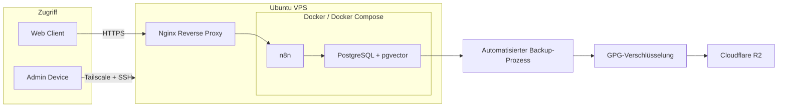

# Self-hosted Linux Infrastruktur

Dieses Repository dokumentiert eine bereinigte Version meiner selbst betriebenen Linux-Infrastruktur für Automatisierungs- und AI-Anwendungen.

Die Umgebung entstand ursprünglich, um n8n-Workflows selbst zu hosten. Im Laufe der Nutzung kamen unter anderem eine selbst gehostete PostgreSQL-Datenbank mit pgvector, automatisierte Backups, verschlüsselte externe Sicherungen sowie verschiedene Maßnahmen für Administration und Systemsicherheit hinzu.

Ziel des Repositories ist nicht, eine vollständig gehärtete Enterprise-Infrastruktur darzustellen, sondern eine praktisch genutzte Umgebung zu dokumentieren, an der ich Linux-Administration, Containerisierung, Datenbanken, Networking, Backup und grundlegende Sicherheitskonzepte praktisch erlernt und angewendet habe.

Dieses Repository enthält ausschließlich eine für die öffentliche Darstellung bereinigte Version. Zugangsdaten, private Schlüssel, reale Hostnamen und IP-Adressen sowie produktive Anwendungs- und Datenbankinhalte sind nicht enthalten.

## Ziele

Beim Aufbau und Betrieb der Umgebung standen mehrere praktische Ziele im Vordergrund:

- eigene Anwendungen und Automatisierungs-Workflows unabhängig von vollständig gemanagten Plattformen betreiben
- grundlegende Linux-Administration praktisch erlernen
- Anwendungen und Datenbanken mit Docker und Docker Compose betreiben
- persistente Daten getrennt von kurzlebigen Containern speichern
- PostgreSQL für verschiedene Anwendungen einsetzen und administrieren
- sicheren administrativen Remote-Zugriff auf den Server ermöglichen
- produktive Daten regelmäßig und automatisiert sichern
- Backups verschlüsselt außerhalb des eigentlichen Servers speichern
- die Wiederherstellbarkeit der gesicherten Daten überprüfen
- Fehler und Konfigurationsprobleme selbstständig analysieren und beheben

Die Infrastruktur wurde schrittweise erweitert. Neue Komponenten wurden jeweils dann ergänzt, wenn sich während des tatsächlichen Betriebs ein konkreter Bedarf ergab.

## Architektur

## Technology Stack

- Ubuntu Linux
- Docker und Docker Compose
- n8n
- PostgreSQL
- pgvector
- Nginx
- Tailscale
- SSH
- GPG
- rclone
- Cloudflare R2
- Bash
- cron

## Infrastruktur

Die Anwendungen laufen containerisiert auf einem Ubuntu-VPS.

n8n dient als Plattform für Automatisierungs- und AI-Workflows. PostgreSQL wird sowohl als Datenbank für n8n als auch für eigene Anwendungen verwendet. Für semantische Suchfunktionen wird PostgreSQL durch pgvector erweitert.

Nginx übernimmt den Reverse-Proxy-Zugriff auf Webanwendungen.

Die Administration des Servers erfolgt über SSH. Passwortbasierte SSH-Anmeldung ist deaktiviert; der Zugriff erfolgt über Public-Key-Authentifizierung. Für den administrativen Netzwerkzugriff wird zusätzlich Tailscale verwendet.

## Netzwerk und Zugriff

Der Server läuft als Ubuntu-VPS und stellt die selbst gehosteten Anwendungen über definierte Netzwerkzugänge bereit.

Webanwendungen werden über HTTPS erreicht. Nginx übernimmt dabei die Funktion des Reverse Proxys und leitet eingehende Anfragen an die entsprechenden internen Dienste weiter.

Die administrative Verbindung zum Server erfolgt über SSH. Für SSH wird Public-Key-Authentifizierung verwendet. Eine Anmeldung ausschließlich per Passwort ist deaktiviert.

Zusätzlich wird Tailscale für den administrativen Netzwerkzugriff verwendet. Dadurch können administrative Dienste über ein privates Overlay-Netzwerk erreicht werden, ohne sie unnötig direkt über das öffentliche Internet zugänglich zu machen.

Die einzelnen Docker-Container kommunizieren innerhalb definierter Docker-Netzwerke miteinander. Dadurch können beispielsweise n8n und PostgreSQL intern miteinander kommunizieren, ohne dass jeder verwendete Dienst einen eigenen öffentlich erreichbaren Port benötigt.

Produktive IP-Adressen, Hostnamen, Zugangsdaten und genaue Netzwerkparameter wurden aus der öffentlichen Version dieses Repositories entfernt.

Weitere Details: [`docs/architecture.md`](docs/architecture.md)

## Datenbank

Aktuell werden unter anderem zwei getrennte PostgreSQL-Datenbanken betrieben:
- eine Datenbank für n8n
- eine Datenbank für einen RAG-basierten Chat-Workflow

PostgreSQL läuft innerhalb der Docker-Umgebung. Persistente Daten werden außerhalb der flüchtigen Container-Schicht gespeichert, sodass Container ersetzt oder aktualisiert werden können, ohne die Datenbankinhalte zu verlieren.

Der RAG-Workflow verwendet zusätzlich die PostgreSQL-Erweiterung pgvector zur Speicherung und Suche von Embeddings.

## Backup-Strategie

Das Backup-System sichert mehrere Bestandteile der Umgebung, darunter:
- PostgreSQL-Datenbanken
- PostgreSQL-Globals
- n8n-Workflow-Exporte
- Docker- und Anwendungskonfiguration
- Nginx-Konfiguration
- relevante n8n-Daten
- cron-Konfiguration
- Informationen zu verwendeten Container-Images

Die erzeugten Backups werden vor dem externen Upload mit GPG verschlüsselt.
Der Upload in den externen Object Storage erfolgt automatisiert über rclone zu Cloudflare R2.

Zusätzlich wird die Integrität der Sicherungen mit SHA-256-Prüfsummen kontrolliert.

Weitere Details:
- [`docs/backup-strategy.md`](docs/backup-strategy.md)
- [`scripts/backup-example.sh`](scripts/backup-example.sh)
- [`docs/restore-test.md`](docs/restore-test.md)

## Wiederherstellung und Verifikation

Backups sind nur dann nützlich, wenn sie tatsächlich wiederhergestellt werden können.

Am 30.09.2026 wurde ein verschlüsseltes Backup aus Cloudflare R2 in einer getrennten PostgreSQL-Testumgebung wiederhergestellt. Beide Datenbank-Dumps konnten ohne Fehler eingespielt werden. Ausgewählte Zeilenzahlen stimmten zum Zeitpunkt des Tests mit den produktiven Datenbanken überein.

Weitere Details:

- [`docs/restore-test.md`](docs/restore-test.md)
- [`verification/verification.sql`](verification/verification.sql)

## Sicherheitsmaßnahmen

Einige der umgesetzten Maßnahmen sind:
- SSH Public-Key-Authentifizierung
- deaktivierte SSH-Passwortanmeldung
- administrativer Zugriff über Tailscale
- Firewall-Konfiguration
- Trennung von Zugangsdaten und öffentlich dokumentierter Konfiguration
- verschlüsselte externe Backups
- Integritätsprüfung von Backup-Dateien
- getrennte PostgreSQL-Datenbanken und Zugänge
- regelmäßige System- und Sicherheitskontrollen

Dieses Projekt ist kein Beispiel für eine vollständig gehärtete Enterprise-Infrastruktur. Ziel war der Aufbau einer praktisch nutzbaren selbst gehosteten Umgebung und das schrittweise Erlernen von Linux-Administration, Containerisierung, Datenbanken, Networking, Backup und grundlegender Systemsicherheit.

Weitere Details: [`docs/security-considerations.md`](docs/security-considerations.md)

## Bekannte Einschränkungen und mögliche Verbesserungen

Die Umgebung ist für den eigenen praktischen Betrieb ausgelegt und nicht als vollständig gehärtete Enterprise-Infrastruktur konzipiert. Einige Bereiche könnten daher technisch weiter verbessert werden.

Eine aktuelle Einschränkung besteht darin, dass n8n in der bestehenden Konfiguration weiterhin als Root innerhalb des Containers läuft. Hintergrund ist, dass es bei einer vorherigen Umstellung auf einen weniger privilegierten Benutzer zu Berechtigungsproblemen mit dem gemounteten n8n-Datenverzeichnis kam. Aus praktischen Gründen wurde die Konfiguration deshalb vorerst nicht weiter umgestellt. Aus Sicht der Systemsicherheit wäre ein Betrieb mit möglichst gering privilegierten Rechten jedoch grundsätzlich vorzuziehen.

Aktuelle beziehungsweise mögliche Verbesserungen sind unter anderem:

- stärkere Einschränkung der Berechtigungen einzelner Container und Prozesse
- automatisierte und regelmäßig ausgeführte Restore-Tests für Datenbank-Backups
- systematischeres Monitoring von Diensten, Speicherplatz, Backup-Status und Ressourcenverbrauch
- zentralisierte Sammlung und Auswertung von Logs
- zusätzliche automatische Benachrichtigungen bei fehlgeschlagenen Diensten oder Backups
- genauere Dokumentation der Abhängigkeiten zwischen Containern und Diensten
- weitere Härtung der Docker- und Betriebssystemkonfiguration
- stärker automatisierte Bereitstellung der Infrastruktur, beispielsweise mit Infrastructure-as-Code-Werkzeugen

Einige dieser Punkte wären für die aktuelle Größe der Umgebung technisch aufwendiger als praktisch notwendig. Sie sind deshalb vor allem als mögliche nächste Entwicklungsschritte dokumentiert und nicht als bereits vollständig umgesetzte Funktionen.

## KI-gestützte Arbeit

Bei Teilen der Shell- und Konfigurationsarbeit sowie bei Tests, Fehleranalyse und Dokumentation kamen KI-gestützte Werkzeuge zum Einsatz. Die beschriebenen Schritte wurden an meiner eigenen Umgebung ausgeführt und anhand der dokumentierten Ergebnisse überprüft.