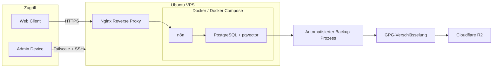

# Architektur

## Überblick

Die Infrastruktur läuft auf einem Ubuntu-VPS. Nginx ist direkt auf dem Host installiert und dient als Reverse Proxy für die Webanwendungen. n8n und PostgreSQL mit pgvector laufen containerisiert über Docker.

Die Umgebung wurde schrittweise für eigene Automatisierungs- und AI-Projekte aufgebaut. Das Diagramm zeigt bewusst nur die wichtigsten Komponenten.

## Architekturdiagramm

## Komponenten

### Ubuntu-VPS und Nginx

Ubuntu bildet die Host-Umgebung. Nginx läuft direkt auf dem Server und nimmt HTTPS-Anfragen entgegen, die anschließend an die entsprechenden internen Dienste weitergeleitet werden.

Der n8n-Dienst ist lokal an den Host gebunden und wird nicht direkt über seinen Anwendungsport öffentlich bereitgestellt.

### Docker

n8n und PostgreSQL laufen als Docker-Container. Docker Compose wird zur Definition und Verwaltung der Dienste verwendet.

Für n8n wird zusätzlich ein separater Task-Runner-Container betrieben, der unter anderem Code aus n8n-Code-Nodes ausführt. Er wurde im Architekturdiagramm aus Gründen der Übersichtlichkeit nicht separat dargestellt.

### PostgreSQL und pgvector

PostgreSQL wird sowohl von n8n als auch von eigenen Anwendungen verwendet. Für den RAG-Chat kommt zusätzlich die Erweiterung pgvector zur Speicherung und semantischen Suche von Embeddings zum Einsatz.

Persistente Daten werden unabhängig vom Lebenszyklus einzelner Container gespeichert.

## Netzwerk und Zugriff

Öffentliche Webzugriffe laufen über HTTPS und Nginx zum jeweiligen internen Dienst.

Die Administration des Servers erfolgt über SSH mit Public-Key-Authentifizierung. Der administrative Netzwerkzugriff erfolgt zusätzlich über Tailscale. Passwortbasierte SSH-Anmeldung ist deaktiviert.

Containerisierte Dienste kommunizieren über interne Docker-Netzwerke miteinander. Dadurch müssen interne Dienste wie PostgreSQL nicht für ihre Kommunikation mit n8n öffentlich erreichbar sein.

## Backup und Wiederherstellung

Relevante Daten und Konfigurationen werden automatisiert gesichert. Die Backups werden vor der externen Speicherung mit GPG verschlüsselt und anschließend über rclone in Cloudflare R2 übertragen.

Die Backup-Strategie und die Überprüfung der Wiederherstellbarkeit sind separat dokumentiert:

- [`backup-strategy.md`](backup-strategy.md)
- [`restore-test.md`](restore-test.md)

## Umfang der öffentlichen Dokumentation

Dieses Repository bildet die wesentliche Struktur der tatsächlich betriebenen Umgebung ab, ist jedoch keine vollständige Kopie der Produktivkonfiguration.

Zugangsdaten, private Schlüssel, reale Hostnamen und IP-Adressen, produktive Daten sowie andere sensible Konfigurationswerte wurden entfernt oder durch Platzhalter ersetzt.